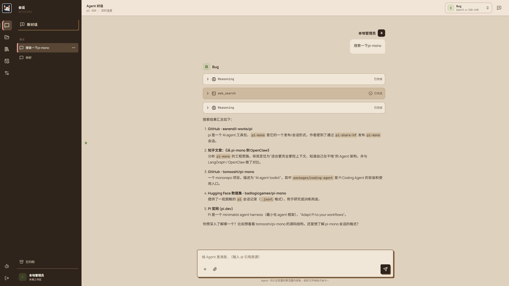
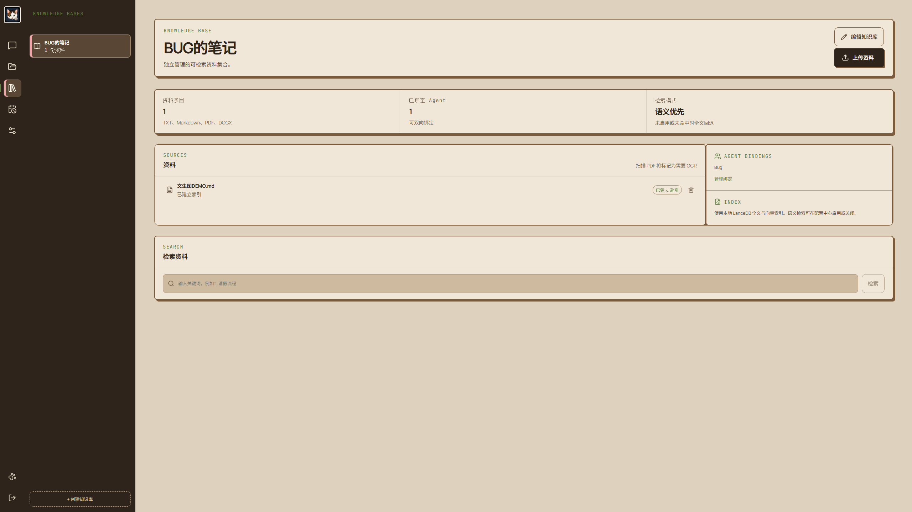
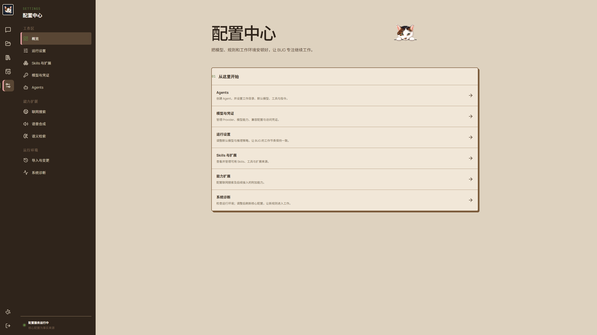
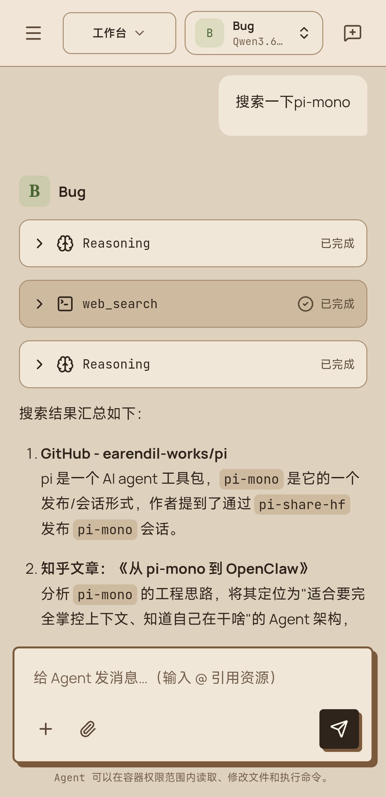
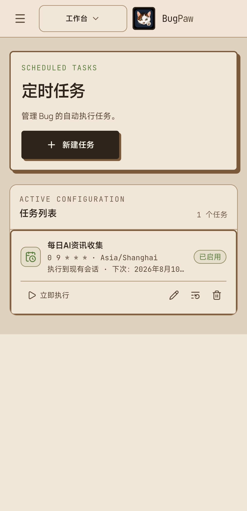

# BugPaw

[中文](#中文) · [English](#english)

<p align="center">
  
</p>
<p align="center"><sub>对话、推理与联网搜索协同工作 / Conversation, reasoning, and web research in one workspace</sub></p>

## 产品截图 / Product screenshots

| 知识库与向量检索 / Knowledge base and vector retrieval | 配置中心 / Settings |
| --- | --- |
|  |  |

<p align="center">
  
  &nbsp;&nbsp;
  
</p>
<p align="center"><sub>响应式移动端：联网搜索与定时任务 / Responsive mobile UI: web research and scheduled tasks</sub></p>

## 中文

BugPaw 是一个基于 [Pi coding agent](https://github.com/badlogic/pi-mono) SDK 构建的自托管个人 Web Agent。它把模型、Agent、会话、工作区文件、知识库、定时任务、语音播放和可选联网检索放在同一个可安装的 Web 应用中，并将运行数据保存在部署者自己的机器上。

> 项目仍处于早期阶段。请先在本机或受信任的私有网络中使用，并阅读[安全说明](#安全说明)。

### 主要功能

- 多 Provider 与模型管理，凭证仅保存在服务端持久化目录中。
- 多 Agent Profile、独立工作区、系统提示词与工具权限。
- 流式对话、思考过程、工具调用、会话重命名、归档与恢复。
- 工作区文件上传、预览、下载、移动、重命名和目录管理。
- 知识库全文检索，以及可选的托管中文向量检索。
- Skills、资源目录、定时任务和长期工作区。
- 可选 SearXNG 联网搜索，带只读边界、SSRF 防护和出口策略。
- 可配置的文本转语音播放。
- 响应式界面和 PWA 安装能力。
- Docker Compose 自托管，核心、搜索、向量服务可独立组合。

### 部署架构

默认只启动 `bug-paw-web`。搜索和向量能力是可选部署层：

| 组件 | 用途 | 是否默认启动 |
| --- | --- | --- |
| `bug-paw-web` | Web UI、API、Pi Runtime 与持久化业务逻辑 | 是 |
| `bug-paw-search` | 私有 SearXNG 搜索 API | 否 |
| `bug-paw-cache` | SearXNG 使用的 Valkey | 否 |
| `bug-paw-embedding` | `BAAI/bge-small-zh-v1.5` 托管向量服务 | 否 |

宿主机默认在所有网络接口监听 `7080` 端口（`0.0.0.0:7080`）。搜索、缓存和向量容器不发布宿主机端口，只在 Compose 内部网络通信。所有应用数据默认写入 `./pi-agent-data` 并挂载到容器 `/data`。

### 系统要求

- Docker Engine 或 Docker Desktop。
- Docker Compose v2（使用 `docker compose` 命令）。
- Linux、macOS，或带 Docker Desktop 与 PowerShell 5.1+ 的 Windows。
- 核心模式建议至少预留 2 GiB 内存；向量模式需要额外磁盘和内存，首次启动会下载模型。
- 使用托管搜索时，部署主机需要访问所启用的搜索引擎；使用托管向量时，需要访问 Hugging Face/GHCR 以拉取镜像和模型。

### 快速开始

Linux 或 macOS：

```bash
# 克隆仓库后进入项目目录
cd bug-paw
./scripts/deploy.sh core
```

Windows PowerShell：

```powershell
# 克隆仓库后进入项目目录
Set-Location bug-paw
.\scripts\deploy.ps1 core
```

脚本会在缺少 `.env` 时从 `.env.example` 创建，不覆盖已有配置；随后校验 Compose、构建镜像、启动容器并等待健康检查。浏览器访问 `http://127.0.0.1:7080` 完成首启初始化。

### 四种部署组合

| 模式 | Bash | PowerShell | 服务 |
| --- | --- | --- | --- |
| 核心 | `./scripts/deploy.sh core` | `.\scripts\deploy.ps1 core` | Web |
| 核心 + 搜索 | `./scripts/deploy.sh search` | `.\scripts\deploy.ps1 search` | Web、SearXNG、Valkey |
| 核心 + 向量 | `./scripts/deploy.sh vector` | `.\scripts\deploy.ps1 vector` | Web、Embedding |
| 全能力 | `./scripts/deploy.sh full` | `.\scripts\deploy.ps1 full` | 全部服务 |

搜索或全能力模式发现 `SEARXNG_SECRET` 为空时，部署脚本会在本机生成强随机值并写入 `.env`，不会打印密钥。

也可以直接使用 Compose：

手动部署前先复制 `.env.example` 为 `.env`；搜索组合还必须填写 `SEARXNG_SECRET`。

```bash
# 核心
docker compose --env-file .env -f compose.yaml up -d --build

# 核心 + 搜索
docker compose --env-file .env -f compose.yaml -f compose.search.yaml up -d --build

# 核心 + 向量
docker compose --env-file .env -f compose.yaml -f compose.vector.yaml up -d --build

# 全能力
docker compose --env-file .env -f compose.yaml -f compose.search.yaml -f compose.vector.yaml up -d --build
```

切换模式时建议使用部署脚本，或在命令末尾增加 `--remove-orphans`，以清理上一个组合不再需要的容器。

### 环境变量

复制示例后按需修改：

```bash
cp .env.example .env
chmod 600 .env
```

| 变量 | 默认值 | 适用模式 | 说明 |
| --- | --- | --- | --- |
| `BUG_PAW_BIND_ADDRESS` | `0.0.0.0` | 全部 | Web 在宿主机的监听地址；只允许本机或反向代理访问时改为 `127.0.0.1`。 |
| `BUG_PAW_PORT` | `7080` | 全部 | Web 的宿主机端口；容器内仍固定为 `7080`。 |
| `BUG_PAW_TIMEZONE` | `Asia/Shanghai` | 全部 | 容器时区，使用 IANA 时区名称。 |
| `BUG_PAW_DATA_DIR` | `./pi-agent-data` | 全部 | 宿主机持久化数据目录。 |
| `SEARXNG_SECRET` | 无 | 搜索、全能力 | SearXNG 服务密钥；必须为强随机值。 |
| `WEB_RESEARCH_TRUSTED_FAKE_IP_CIDRS` | `198.18.0.0/15` | 搜索、全能力 | 允许代理解析的测试网段；大多数部署无需修改。 |
| `WEB_RESEARCH_EGRESS_PROFILES_FILE` | `./config/web-research-egress-profiles.json` | 搜索、全能力 | 联网读取出口配置文件。 |
| `BUG_PAW_EMBEDDING_CPUS` | `2.0` | 向量、全能力 | 托管 Embedding 容器 CPU 上限。 |

`NODE_ENV`、容器内 `PORT`、`PI_AGENT_DATA_ROOT` 和托管能力开关属于镜像与 Compose 的内部约定，不应放入 `.env` 手工覆盖。模型 Provider API Key、TTS Key 等业务凭证通过 BugPaw 配置中心写入服务端，不属于 Compose 环境变量。

### 启用可选能力

部署搜索组合后，进入“能力扩展 → 联网搜索”检查连接并显式启用。默认搜索策略只允许读取公开 HTTP(S) 页面，并执行协议、地址、重定向、响应大小和内容类型校验。

部署向量组合后，内置 `BAAI/bge-small-zh-v1.5` 配置会作为托管服务可用。核心模式首次启动时托管向量默认关闭；仍可在配置中心连接部署者自己的 OpenAI 兼容 Embedding 服务。

### 日常操作

查看状态和健康接口：

```bash
docker compose --env-file .env -f compose.yaml -f compose.search.yaml -f compose.vector.yaml ps
curl --fail --silent --show-error http://127.0.0.1:7080/healthz
```

更新源码部署：

```bash
git pull --ff-only
./scripts/deploy.sh full
```

停止全能力部署：

```bash
docker compose --env-file .env -f compose.yaml -f compose.search.yaml -f compose.vector.yaml down --remove-orphans
```

删除容器不会删除 `BUG_PAW_DATA_DIR`。如需完全卸载，请先备份，再手动删除明确的数据目录；不要对不确定路径使用递归删除命令。

### 数据、备份与恢复

`pi-agent-data/` 可能包含模型凭证、登录会话、Agent 配置、聊天记录、知识库、附件和工作区文件，应按敏感数据保护。备份前先停止写入：

```bash
docker compose --env-file .env -f compose.yaml -f compose.search.yaml -f compose.vector.yaml stop
tar -czf bugpaw-data-backup.tar.gz pi-agent-data
sha256sum bugpaw-data-backup.tar.gz > bugpaw-data-backup.tar.gz.sha256
```

恢复时保持应用停止，将备份内容解压回配置的 `BUG_PAW_DATA_DIR`，确认所有者和权限后重新部署。备份文件本身也含敏感数据，建议加密保存并限制访问。

### 安全说明

- 默认监听所有网络接口。部署前应配置防火墙；公网访问应使用 HTTPS 反向代理、访问控制和可信网络边界。仅需本机或反向代理访问时，将 `BUG_PAW_BIND_ADDRESS` 改为 `127.0.0.1`。
- Agent 在容器内拥有较强的文件与命令执行能力；默认 Compose 不启用 privileged，也不挂载 Docker Socket。
- 不要把 `.env`、`pi-agent-data/`、备份、API Key、认证 Header 或生产日志提交到 Git。
- 联网搜索能访问外部网站。启用前检查出口配置、允许域名和组织的数据政策。
- 定期更新源码和基础镜像，并在生产升级前备份。
- 安全问题请按 [SECURITY.md](SECURITY.md) 私下报告，不要在公开 Issue 中披露密钥或可利用细节。

### 本地开发

安装依赖并启动开发服务：

```bash
npm ci
npm run dev
```

项目规定生产验证统一在 Node 24 容器中运行：

```bash
docker run --rm -v "$PWD:/workspace" -w /workspace node:24-bookworm-slim npm test
docker run --rm -v "$PWD:/workspace" -w /workspace node:24-bookworm-slim npm run build
docker run --rm -v "$PWD:/workspace" -w /workspace node:24-bookworm-slim npm run verify
```

更多架构与安全边界见 `docs/`。贡献前请阅读 [CONTRIBUTING.md](CONTRIBUTING.md)。

### 目录结构

```text
.
├── compose.yaml                 # 核心部署
├── compose.search.yaml          # 搜索与缓存叠加层
├── compose.vector.yaml          # 托管向量叠加层
├── Dockerfile
├── .env.example
├── config/                      # 非敏感应用部署配置
├── searxng/                     # 非敏感 SearXNG 配置
├── scripts/                     # 构建检查与部署助手
├── src/                         # Web、服务端与共享源码
├── tests/                       # 集成测试
├── public/                      # PWA 与静态资源
└── docs/                        # 架构、设计与实施文档
```

### 贡献、许可证与支持

欢迎通过 Issue 提交可复现的问题，通过 Pull Request 提交聚焦且带测试的改动。提交前请运行 `npm run verify`，并确保不包含敏感数据。

本项目采用 [Apache License 2.0](LICENSE) 开源。使用、修改和分发时请遵守许可证条款，并保留适用的版权与许可证声明。第三方依赖与字体说明见 [THIRD_PARTY_NOTICES.md](THIRD_PARTY_NOTICES.md)。

请通过仓库 Issue 报告普通缺陷和功能建议；安全问题使用 [SECURITY.md](SECURITY.md) 中的私密渠道。

---

## English

BugPaw is a self-hosted personal Web Agent built on the [Pi coding agent](https://github.com/badlogic/pi-mono) SDK. It brings models, agents, conversations, workspace files, knowledge bases, scheduled tasks, speech playback, and optional web research into one installable web application while keeping runtime data on infrastructure you control.

> BugPaw is at an early stage. Start on a local machine or trusted private network and review the [security guidance](#security-guidance) before exposing it.

### Features

- Multiple providers and models, with credentials stored only in server-side persistent data.
- Multiple Agent profiles with isolated workspaces, prompts, and tool permissions.
- Streaming chat, reasoning segments, tool activity, and session rename/archive/restore flows.
- Workspace upload, preview, download, move, rename, and directory management.
- Full-text knowledge retrieval plus optional managed Chinese embeddings.
- Skills, resource discovery, scheduled tasks, and durable workspaces.
- Optional SearXNG research with read-only boundaries, SSRF controls, and egress policies.
- Configurable text-to-speech playback.
- Responsive UI with PWA installation support.
- Composable Docker deployments for core, search, and vector services.

### Architecture

The default deployment starts only `bug-paw-web`. Search and vector services are optional layers:

| Component | Purpose | Started by default |
| --- | --- | --- |
| `bug-paw-web` | Web UI, API, Pi runtime, and persistent application logic | Yes |
| `bug-paw-search` | Private SearXNG search API | No |
| `bug-paw-cache` | Valkey for SearXNG | No |
| `bug-paw-embedding` | Managed `BAAI/bge-small-zh-v1.5` embeddings | No |

The host listens on port `7080` on all network interfaces by default (`0.0.0.0:7080`). Search, cache, and embedding containers do not publish host ports. Application data is stored in `./pi-agent-data` and mounted at `/data` inside the Web container.

### Requirements

- Docker Engine or Docker Desktop.
- Docker Compose v2 via the `docker compose` command.
- Linux, macOS, or Windows with Docker Desktop and PowerShell 5.1+.
- At least 2 GiB of available memory is recommended for core mode. Vector mode needs additional memory and disk, and downloads the model on first start.
- Managed search requires outbound access to enabled search engines. Managed vector deployment requires access to GHCR and Hugging Face for images and model files.

### Quick start

Linux or macOS:

```bash
# After cloning the repository, enter the project directory
cd bug-paw
./scripts/deploy.sh core
```

Windows PowerShell:

```powershell
# After cloning the repository, enter the project directory
Set-Location bug-paw
.\scripts\deploy.ps1 core
```

If `.env` is missing, the helper creates it from `.env.example` without replacing existing settings. It validates Compose, builds the image, starts services, and waits for health checks. Open `http://127.0.0.1:7080` to complete first-run setup.

### Deployment combinations

| Mode | Bash | PowerShell | Services |
| --- | --- | --- | --- |
| Core | `./scripts/deploy.sh core` | `.\scripts\deploy.ps1 core` | Web |
| Core + search | `./scripts/deploy.sh search` | `.\scripts\deploy.ps1 search` | Web, SearXNG, Valkey |
| Core + vector | `./scripts/deploy.sh vector` | `.\scripts\deploy.ps1 vector` | Web, Embedding |
| Full | `./scripts/deploy.sh full` | `.\scripts\deploy.ps1 full` | All services |

For search and full modes, the helper generates a strong local `SEARXNG_SECRET` when the value is empty. The secret is written to `.env` and never printed.

Manual Compose equivalents:

Before deploying manually, copy `.env.example` to `.env`. Search combinations also require a non-empty `SEARXNG_SECRET`.

```bash
# Core
docker compose --env-file .env -f compose.yaml up -d --build

# Core + search
docker compose --env-file .env -f compose.yaml -f compose.search.yaml up -d --build

# Core + vector
docker compose --env-file .env -f compose.yaml -f compose.vector.yaml up -d --build

# Full
docker compose --env-file .env -f compose.yaml -f compose.search.yaml -f compose.vector.yaml up -d --build
```

When changing modes, use the deployment helper or add `--remove-orphans` so services from the previous combination are removed.

### Environment variables

Create a local configuration file:

```bash
cp .env.example .env
chmod 600 .env
```

| Variable | Default | Modes | Description |
| --- | --- | --- | --- |
| `BUG_PAW_BIND_ADDRESS` | `0.0.0.0` | All | Host bind address. Set it to `127.0.0.1` when access should be limited to the local host or a reverse proxy. |
| `BUG_PAW_PORT` | `7080` | All | Published host port; the container port remains `7080`. |
| `BUG_PAW_TIMEZONE` | `Asia/Shanghai` | All | Container time zone as an IANA identifier. |
| `BUG_PAW_DATA_DIR` | `./pi-agent-data` | All | Persistent host data directory. |
| `SEARXNG_SECRET` | None | Search, full | Strong random SearXNG service secret. |
| `WEB_RESEARCH_TRUSTED_FAKE_IP_CIDRS` | `198.18.0.0/15` | Search, full | Test-network ranges eligible for proxy resolution; usually unchanged. |
| `WEB_RESEARCH_EGRESS_PROFILES_FILE` | `./config/web-research-egress-profiles.json` | Search, full | Web research egress profile file. |
| `BUG_PAW_EMBEDDING_CPUS` | `2.0` | Vector, full | CPU limit for the managed embedding container. |

`NODE_ENV`, the internal `PORT`, `PI_AGENT_DATA_ROOT`, and managed capability flags are image/Compose contracts and should not be overridden manually. Provider and TTS credentials are configured inside BugPaw and are not Compose environment variables.

### Enabling optional capabilities

After deploying search mode, open **Capabilities → Web research**, test the connection, and explicitly enable it. The default policy limits access to public HTTP(S) pages and validates schemes, addresses, redirects, response sizes, and content types.

After deploying vector mode, the bundled `BAAI/bge-small-zh-v1.5` configuration becomes available. Core-only first runs keep managed embeddings disabled; an administrator may still configure an external OpenAI-compatible embedding endpoint.

### Operations

Check services and health:

```bash
docker compose --env-file .env -f compose.yaml -f compose.search.yaml -f compose.vector.yaml ps
curl --fail --silent --show-error http://127.0.0.1:7080/healthz
```

Update and redeploy:

```bash
git pull --ff-only
./scripts/deploy.sh full
```

Stop the full deployment:

```bash
docker compose --env-file .env -f compose.yaml -f compose.search.yaml -f compose.vector.yaml down --remove-orphans
```

Removing containers does not delete `BUG_PAW_DATA_DIR`. For complete removal, back up the data and delete only the explicit configured directory.

### Data, backup, and recovery

`pi-agent-data/` can contain provider credentials, login sessions, Agent configuration, chats, knowledge bases, attachments, and workspace files. Treat it as sensitive. Stop writes before backup:

```bash
docker compose --env-file .env -f compose.yaml -f compose.search.yaml -f compose.vector.yaml stop
tar -czf bugpaw-data-backup.tar.gz pi-agent-data
sha256sum bugpaw-data-backup.tar.gz > bugpaw-data-backup.tar.gz.sha256
```

To restore, keep the application stopped, extract the archive into `BUG_PAW_DATA_DIR`, verify ownership and permissions, and deploy again. Backups contain sensitive data and should be encrypted and access-controlled.

### Security guidance

- The default bind address exposes the Web port on all network interfaces. Configure a firewall before deployment, and use an HTTPS reverse proxy, access controls, and a trusted network boundary for Internet access. Set `BUG_PAW_BIND_ADDRESS` to `127.0.0.1` for local-host or reverse-proxy-only access.
- Agents have broad file and command capabilities inside the container. The default Compose setup does not enable privileged mode or mount the Docker socket.
- Never commit `.env`, `pi-agent-data/`, backups, API keys, authentication headers, or production logs.
- Web research makes outbound requests. Review egress profiles, allowed domains, and organizational policy before enabling it.
- Update source and base images regularly and back up before production upgrades.
- Report vulnerabilities privately using [SECURITY.md](SECURITY.md); do not disclose secrets or exploitable details in public issues.

### Development

Install dependencies and start the development server:

```bash
npm ci
npm run dev
```

Production verification is standardized on Node 24 containers:

```bash
docker run --rm -v "$PWD:/workspace" -w /workspace node:24-bookworm-slim npm test
docker run --rm -v "$PWD:/workspace" -w /workspace node:24-bookworm-slim npm run build
docker run --rm -v "$PWD:/workspace" -w /workspace node:24-bookworm-slim npm run verify
```

See `docs/` for architecture and security boundaries. Read [CONTRIBUTING.md](CONTRIBUTING.md) before contributing.

### Repository layout

```text
.
├── compose.yaml
├── compose.search.yaml
├── compose.vector.yaml
├── Dockerfile
├── .env.example
├── config/
├── searxng/
├── scripts/
├── src/
├── tests/
├── public/
└── docs/
```

### Contributing, license, and support

Reproducible issue reports and focused pull requests with tests are welcome. Run `npm run verify` before submitting changes and ensure no sensitive data is included.

BugPaw is released under the [Apache License 2.0](LICENSE). Use, modification, and distribution are subject to its terms, including preservation of applicable copyright and license notices. See [THIRD_PARTY_NOTICES.md](THIRD_PARTY_NOTICES.md) for notable dependency and font licensing information.

Use repository issues for ordinary bugs and feature requests. Use the private channel documented in [SECURITY.md](SECURITY.md) for vulnerabilities.

## Bug 本 Bug / Meet Bug

<p align="center">
  
</p>
<p align="center"><sub>功能跑完了，Bug 先睡一会儿。 / Everything is running. Bug is taking a nap.</sub></p>
